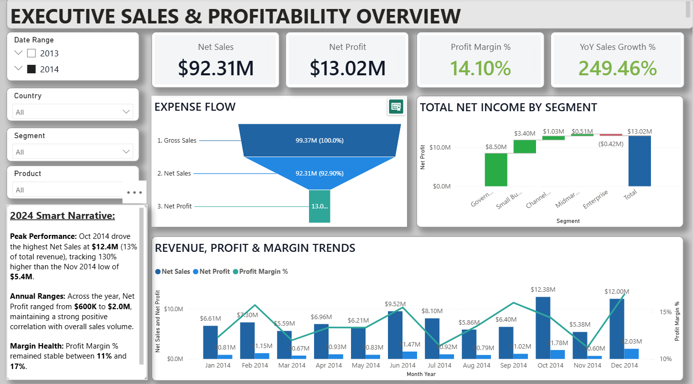
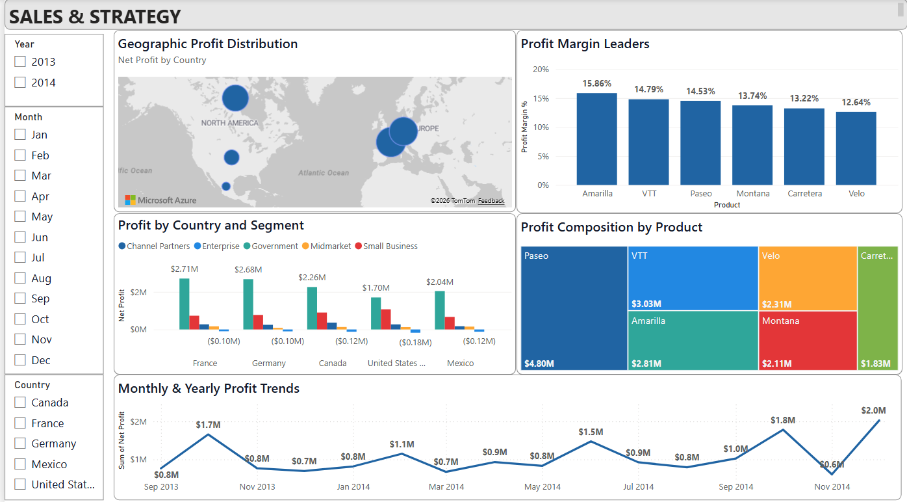

# Sales Performance & Profitability Dashboard

Power BI project analysing sales, profitability, product performance, customer segments and geographic trends using a 7,000 transaction sample financial dataset.

## Overview

The dashboard was designed to provide an executive and strategic view of business performance, helping identify the main drivers of revenue and profitability as well as areas of commercial risk.

## Business Questions

- How are sales and profitability changing over time?
- Which products generate the strongest profit and margins?
- Which customer segments contribute most to profitability?
- How does performance vary across countries?
- How does discounting affect profit margins?

## Dashboard

### Executive Sales & Profitability Overview

### Sales & Strategy

## Key Findings

- The Government segment generated $52.5M in sales and $11.4M in profit, accounting for around 67% of total profit.
- Enterprise generated $19.6M in sales but produced a $0.6M loss, highlighting profitability concerns.
- Paseo was the strongest product by total profit, while Amarilla achieved the highest product margin.
- Profit margins declined from 21.9% with no discount to 9.1% under high discounts.
- Geographic performance was relatively diversified, with Germany and France achieving the strongest margins.

## Process & Skills

### Data Preparation
- Imported and cleaned data using Power Query
- Corrected data types and formatting
- Renamed and reordered fields
- Applied transformations to prepare the dataset for analysis

### Data Modelling
- Created fact and dimension tables
- Built relationships between tables
- Created a dedicated DAX Date Table for time-based analysis

### DAX
Developed measures including:
- Net Sales
- Net Profit
- Profit Margin %
- YoY Sales Growth %
- Total Discounts
- Discount Rate %

### Visualisation
- Designed interactive executive and strategic report pages
- Used KPI cards, maps, waterfall charts, treemaps and trend visuals
- Added slicers and cross-filtering

## Date Table

A custom date dimension was created in DAX to support time intelligence and reporting.

See:

[dax/date-table.dax](dax/date-table.dax)

## Tools

- Power BI
- Power Query
- DAX
- Data Modelling
- Microsoft Excel

## Dataset

Financial Sample dataset.

Source:
https://learn.microsoft.com/en-us/power-bi/create-reports/sample-financial-download

## Files

- `powerbi/` — Power BI project file
- `screenshots/` — dashboard screenshots
- `dax/` — DAX scripts used in the project
